  
  
  
  

---

---

### 🛠️ Tech Stack

  
  
  
  
   
  
  
  
  
   
  
  
  
  
   
  
  
   
  
  
  
  
  
  
   
  
  
  
  

---

---

### 📊 GitHub Stats

  
  

  

⭐️ Thanks for stopping by! Feel free to explore my repositories and connect with me.

